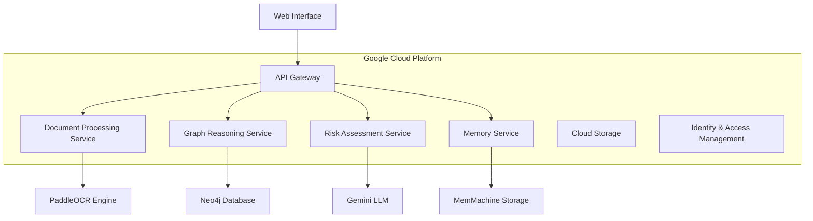
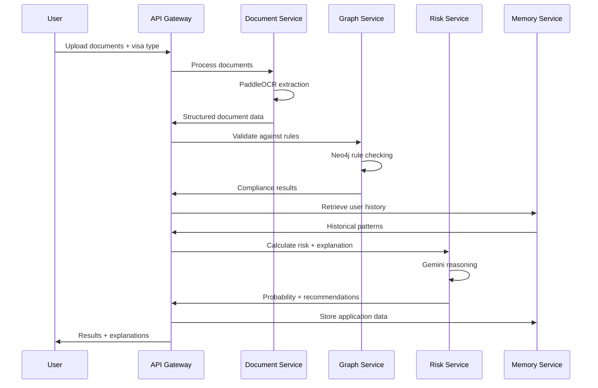

# VisaVerse Guardian AI - Design Document

## Overview

VisaVerse Guardian AI is a production-grade, multi-component AI system that provides predictive intelligence for global mobility decisions. The system combines document intelligence (PaddleOCR), graph-based reasoning (Neo4j), large language model capabilities (Gemini), and persistent memory (MemMachine) to deliver explainable visa approval predictions with actionable recommendations.

The architecture follows a microservices pattern deployed on Google Cloud Platform, with each component handling specific aspects of the document analysis and decision pipeline. The system processes multilingual documents, validates them against complex visa rules, and provides transparent explanations while learning from historical patterns.

## Architecture

### High-Level System Architecture



### Component Architecture

The system consists of five primary services:

1. **Document Processing Service**: Handles OCR extraction and document structuring
2. **Graph Reasoning Service**: Manages rule validation and compliance checking
3. **Risk Assessment Service**: Calculates probabilities and generates explanations
4. **Memory Service**: Manages persistent learning and historical data
5. **API Gateway**: Orchestrates the processing pipeline and manages user interactions

### Data Flow Pipeline



## Components and Interfaces

### Document Processing Service

**Responsibilities:**
- Multilingual OCR processing using PaddleOCR
- Document type classification
- Structured data extraction
- Quality assessment and confidence scoring

**Key Interfaces:**
```typescript
interface DocumentProcessingService {
  processDocuments(files: File[], language?: string): Promise<ProcessedDocument[]>
  extractStructuredData(document: ProcessedDocument): Promise<StructuredData>
  validateDocumentQuality(document: ProcessedDocument): Promise<QualityScore>
}

interface ProcessedDocument {
  documentType: string
  extractedText: string
  layoutInfo: LayoutData
  tableData: TableData[]
  confidenceScore: number
  language: string
}

interface StructuredData {
  documentType: string
  keyFields: Record<string, any>
  dates: DateField[]
  financialInfo: FinancialData
  missingFields: string[]
  extractionConfidence: number
}
```

### Graph Reasoning Service

**Responsibilities:**
- Visa rule modeling and storage
- Multi-hop compliance validation
- Relationship reasoning
- Transparent explanation generation

**Key Interfaces:**
```typescript
interface GraphReasoningService {
  validateCompliance(data: StructuredData, visaType: string, country: string): Promise<ComplianceResult>
  getReasoningPath(validationId: string): Promise<ReasoningPath>
  updateRules(country: string, rules: VisaRule[]): Promise<void>
}

interface ComplianceResult {
  isCompliant: boolean
  violations: RuleViolation[]
  reasoningPath: ReasoningPath
  requiredDocuments: string[]
  satisfiedRequirements: string[]
}

interface ReasoningPath {
  steps: ReasoningStep[]
  conclusion: string
  confidence: number
}
```

### Risk Assessment Service

**Responsibilities:**
- Probability calculation
- Natural language explanation generation
- Cross-document reasoning
- Recommendation synthesis

**Key Interfaces:**
```typescript
interface RiskAssessmentService {
  calculateApprovalProbability(
    compliance: ComplianceResult,
    historicalData: HistoricalPattern[],
    documentData: StructuredData[]
  ): Promise<RiskAssessment>
  
  generateExplanation(assessment: RiskAssessment, language: string): Promise<ExplanationResult>
}

interface RiskAssessment {
  approvalProbability: number
  riskFactors: RiskFactor[]
  recommendations: Recommendation[]
  confidenceLevel: number
}

interface ExplanationResult {
  summary: string
  detailedExplanation: string
  actionableSteps: string[]
  riskBreakdown: RiskBreakdown
}
```

### Memory Service

**Responsibilities:**
- Historical data storage and retrieval
- Pattern recognition
- Personalized insights
- Learning from outcomes

**Key Interfaces:**
```typescript
interface MemoryService {
  storeApplication(userId: string, application: ApplicationData): Promise<void>
  getUserHistory(userId: string): Promise<HistoricalPattern[]>
  updateOutcome(applicationId: string, outcome: ApplicationOutcome): Promise<void>
  getPersonalizedInsights(userId: string, currentApplication: ApplicationData): Promise<PersonalizedInsight[]>
}

interface HistoricalPattern {
  applicationId: string
  visaType: string
  country: string
  outcome: ApplicationOutcome
  riskFactors: RiskFactor[]
  timestamp: Date
}
```

## Data Models

### Core Domain Models

```typescript
// Document Models
interface Document {
  id: string
  type: DocumentType
  content: string
  metadata: DocumentMetadata
  extractedData: StructuredData
  processingStatus: ProcessingStatus
}

enum DocumentType {
  PASSPORT = 'passport',
  VISA_APPLICATION = 'visa_application',
  EMPLOYMENT_LETTER = 'employment_letter',
  BANK_STATEMENT = 'bank_statement',
  EDUCATIONAL_CERTIFICATE = 'educational_certificate',
  MEDICAL_CERTIFICATE = 'medical_certificate'
}

// Application Models
interface VisaApplication {
  id: string
  userId: string
  visaType: string
  targetCountry: string
  documents: Document[]
  status: ApplicationStatus
  riskAssessment?: RiskAssessment
  submissionDate: Date
  lastUpdated: Date
}

// Rule Models
interface VisaRule {
  id: string
  country: string
  visaType: string
  ruleType: RuleType
  conditions: RuleCondition[]
  requirements: Requirement[]
  priority: number
}

interface RuleCondition {
  field: string
  operator: ComparisonOperator
  value: any
  description: string
}

// Risk Models
interface RiskFactor {
  id: string
  category: RiskCategory
  severity: RiskSeverity
  description: string
  impact: number
  recommendation: string
}

enum RiskCategory {
  DOCUMENT_MISSING = 'document_missing',
  DOCUMENT_INVALID = 'document_invalid',
  REQUIREMENT_NOT_MET = 'requirement_not_met',
  INCONSISTENCY = 'inconsistency',
  HISTORICAL_PATTERN = 'historical_pattern'
}

enum RiskSeverity {
  LOW = 'low',
  MEDIUM = 'medium',
  HIGH = 'high',
  CRITICAL = 'critical'
}
```

### Neo4j Graph Schema

```cypher
// Node Types
CREATE CONSTRAINT ON (c:Country) ASSERT c.code IS UNIQUE;
CREATE CONSTRAINT ON (v:VisaType) ASSERT v.id IS UNIQUE;
CREATE CONSTRAINT ON (d:DocumentType) ASSERT d.name IS UNIQUE;
CREATE CONSTRAINT ON (r:Requirement) ASSERT r.id IS UNIQUE;
CREATE CONSTRAINT ON (f:Field) ASSERT f.name IS UNIQUE;

// Relationship Types
(:Country)-[:OFFERS]->(:VisaType)
(:VisaType)-[:REQUIRES]->(:DocumentType)
(:DocumentType)-[:MUST_HAVE]->(:Field)
(:Field)-[:VALIDATES_AGAINST]->(:Requirement)
(:Requirement)-[:DEPENDS_ON]->(:Requirement)
```

## 
## Correctness Properties

*A property is a characteristic or behavior that should hold true across all valid executions of a system-essentially, a formal statement about what the system should do. Properties serve as the bridge between human-readable specifications and machine-verifiable correctness guarantees.*

Based on the prework analysis, I've identified properties that can be combined and consolidated to eliminate redundancy. The following properties provide comprehensive validation coverage:

### Property Reflection

After reviewing all testable acceptance criteria, several properties can be consolidated:
- Multiple OCR-related properties (1.1, 1.5, 4.1-4.5) can be combined into comprehensive document processing properties
- Explanation and reasoning properties (2.3, 2.4, 5.3, 6.1, 8.1, 8.2) share common validation patterns
- Memory and persistence properties (3.1, 3.2, 3.5) can be unified
- Cross-document validation properties (5.5, 6.2) address similar concerns

### Core Properties

**Property 1: Document Processing Completeness**
*For any* uploaded document in any supported language, the OCR processing should extract structured data including document type, key fields, dates, financial information, and missing elements, with confidence scores provided for all extractions
**Validates: Requirements 1.1, 1.5, 4.1, 4.2, 4.3, 4.4, 4.5**

**Property 2: Compliance Validation Consistency**
*For any* extracted document data and visa type/country combination, the system should validate against compliance rules and produce consistent results with reasoning paths
**Validates: Requirements 1.2, 5.1, 5.2, 5.4**

**Property 3: Probability Calculation Completeness**
*For any* compliance validation result, the system should calculate an approval probability between 0-100% with transparent explanations
**Validates: Requirements 1.3, 1.4**

**Property 4: Risk Factor Explanation Completeness**
*For any* identified compliance issue, the system should provide specific risk factors with actionable recommendations and severity categorization
**Validates: Requirements 2.1, 2.2, 2.5**

**Property 5: Reasoning Traceability**
*For any* system decision or explanation, all reasoning should be traceable to validated graph rules or OCR data without hallucination
**Validates: Requirements 2.3, 2.4, 5.3, 6.5, 8.2, 8.3, 8.5**

**Property 6: Cross-Document Consistency Validation**
*For any* application with multiple documents, the system should identify and report inconsistencies or missing information across document relationships
**Validates: Requirements 5.5, 6.2**

**Property 7: Natural Language Explanation Quality**
*For any* technical compliance issue, the system should generate clear, user-friendly explanations and actionable recommendations in the requested language
**Validates: Requirements 6.1, 6.3, 6.4**

**Property 8: Memory Persistence and Learning**
*For any* user application, the system should store the data persistently and reference historical patterns in subsequent applications to provide personalized insights
**Validates: Requirements 3.1, 3.2, 3.3, 3.4, 3.5**

**Property 9: Audit Trail Completeness**
*For any* processing activity, the system should generate complete audit entries that maintain traceability of all operations
**Validates: Requirements 7.4**

**Property 10: Transparency and Disclaimer Compliance**
*For any* system output, results should include human-interpretable explanations and clear disclaimers indicating analysis rather than legal advice
**Validates: Requirements 8.1, 8.4**

## Error Handling

### Document Processing Errors
- **OCR Failures**: When document quality is too poor for reliable extraction, return confidence scores below threshold with specific quality issues identified
- **Unsupported Languages**: Graceful degradation with notification when document language is not in the supported 80+ language set
- **Corrupted Files**: Proper error messages for unreadable or corrupted document uploads
- **Large File Handling**: Timeout and memory management for oversized documents

### Graph Reasoning Errors
- **Missing Rules**: Default to conservative risk assessment when country-specific rules are unavailable
- **Rule Conflicts**: Conflict resolution strategy with transparent explanation of which rules take precedence
- **Graph Connectivity Issues**: Fallback to available rule subsets with notification of incomplete analysis
- **Circular Dependencies**: Detection and breaking of circular rule dependencies

### LLM Integration Errors
- **API Failures**: Fallback to template-based explanations when Gemini API is unavailable
- **Rate Limiting**: Queue management and retry logic for API rate limits
- **Context Length Limits**: Intelligent truncation of input data while preserving critical information
- **Hallucination Detection**: Validation that LLM outputs reference actual input data

### Memory System Errors
- **Storage Failures**: Graceful degradation when persistent memory is unavailable
- **Data Corruption**: Validation and recovery mechanisms for corrupted historical data
- **Privacy Compliance**: Automatic data anonymization and retention policy enforcement
- **Concurrent Access**: Proper locking and consistency mechanisms for simultaneous user access

### Integration Errors
- **Service Unavailability**: Circuit breaker patterns for dependent services
- **Data Format Mismatches**: Schema validation and transformation between service boundaries
- **Network Failures**: Retry logic with exponential backoff for network operations
- **Authentication Failures**: Proper error handling for expired or invalid credentials

## Testing Strategy

### Dual Testing Approach

The system requires both unit testing and property-based testing to ensure comprehensive coverage:

- **Unit tests** verify specific examples, edge cases, and error conditions
- **Property tests** verify universal properties that should hold across all inputs
- Together they provide comprehensive coverage: unit tests catch concrete bugs, property tests verify general correctness

### Property-Based Testing Requirements

- **Testing Library**: Use **Hypothesis** for Python property-based testing
- **Test Configuration**: Each property-based test must run a minimum of 100 iterations
- **Test Tagging**: Each property-based test must include a comment with the format: `**Feature: visaverse-guardian-ai, Property {number}: {property_text}**`
- **Property Implementation**: Each correctness property must be implemented by a single property-based test
- **Data Generators**: Create intelligent generators that constrain to realistic input spaces (valid document formats, realistic visa rules, proper language codes)

### Unit Testing Requirements

Unit tests should focus on:
- Specific examples demonstrating correct behavior for each component
- Integration points between services (API contracts, data transformations)
- Error conditions and edge cases not covered by property tests
- Mock external dependencies (PaddleOCR, Neo4j, Gemini API, MemMachine)

### Integration Testing

- **End-to-End Workflows**: Test complete document processing pipelines
- **Service Communication**: Validate API contracts between microservices
- **Data Consistency**: Verify data integrity across service boundaries
- **Performance Testing**: Load testing for concurrent document processing

### Testing Infrastructure

- **Test Data Management**: Synthetic document generation for various languages and formats
- **Mock Services**: Containerized mock versions of external dependencies
- **CI/CD Integration**: Automated testing in Google Cloud Build pipelines
- **Test Environment**: Isolated testing environment with production-like data volumes